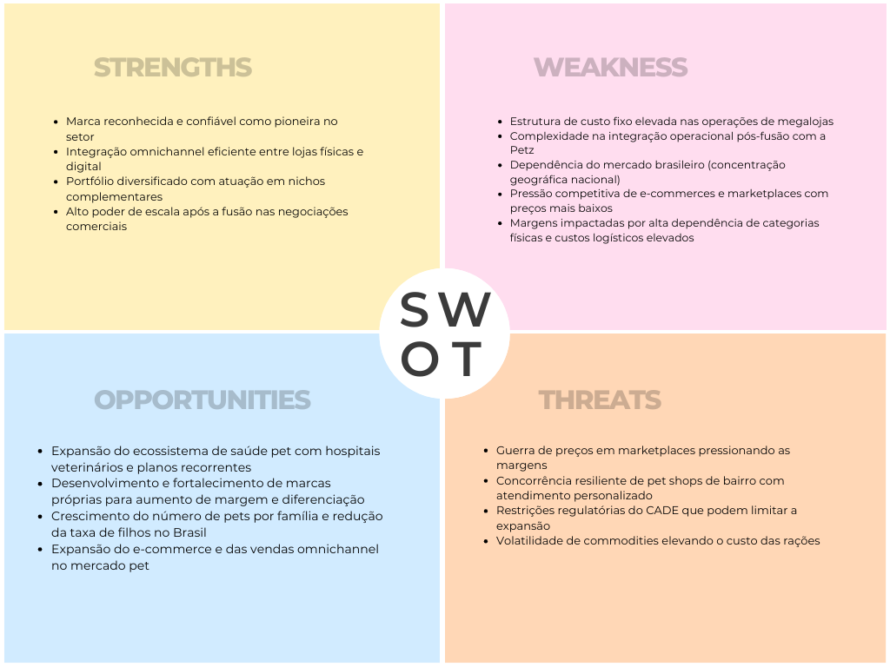
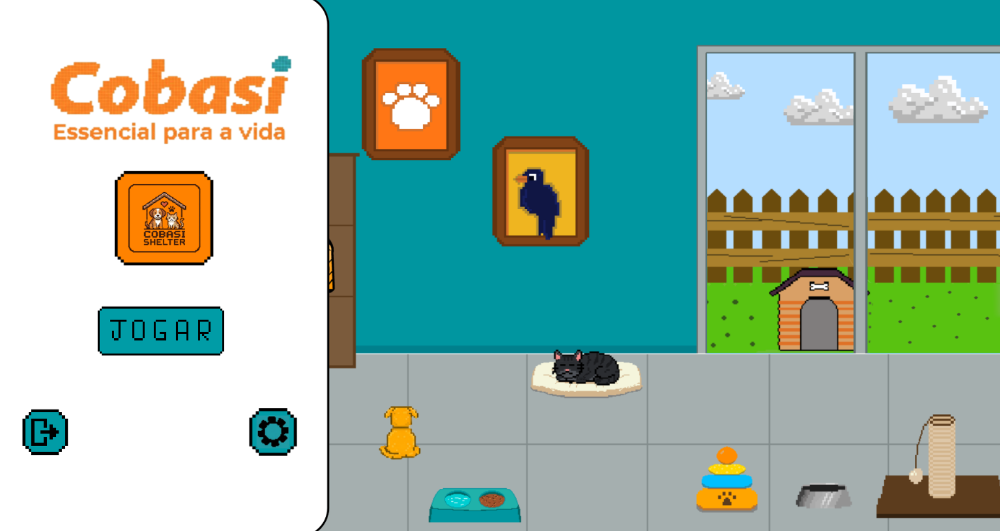
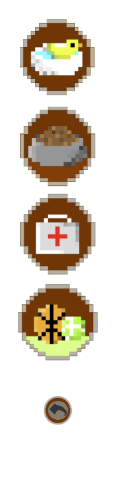
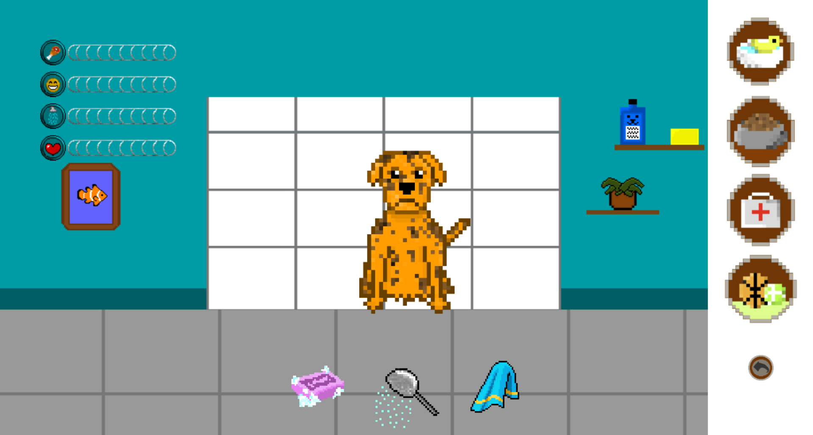
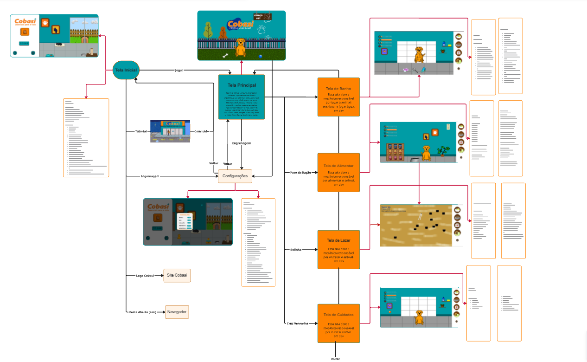
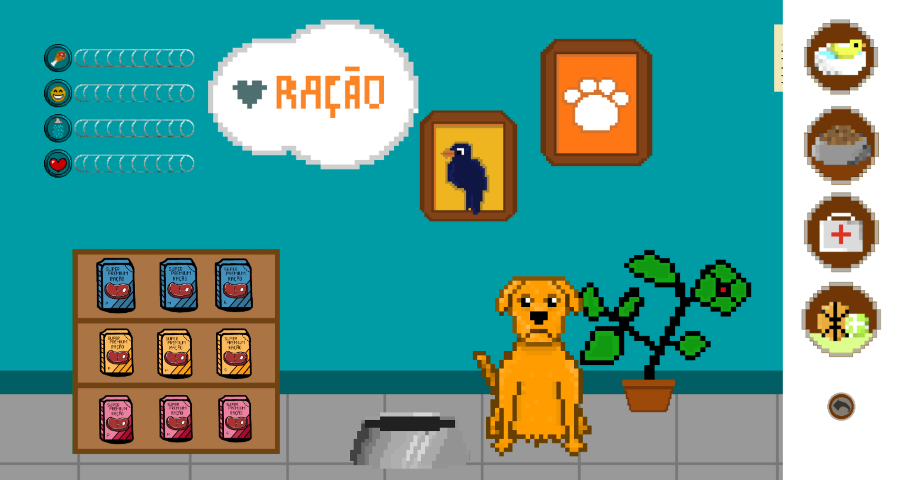
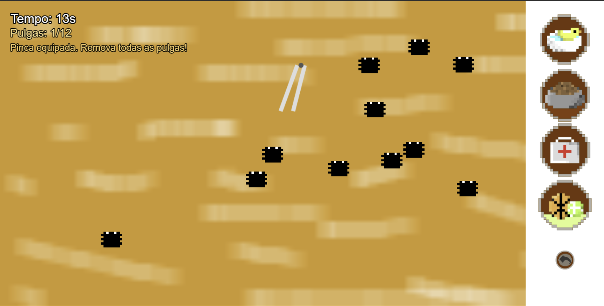

# GDD - Game Design Document - Módulo 1 - Inteli

## Bordot Studios

Ana Célia Augusta Santos do Amaral  
Anita Fratelli Sonobe Silveira  
Davi Viana Tricarico  
Gustavo Luz Fantasia Barbosa  
Isaac Nicolas Alves Silva  
João Pedro Fuzzo Poveda  
Pedro Lemos Negri
Valter Lucas Garcia de Lima

## Sumário

[1. Introdução](#c1)  
<small>1.1 Plano Estratégico do Projeto  
1.1.1 Contexto da Industria  
1.1.1.1 Modelo de 5 Forças de Porter  
1.1.1.2 Ameaça de Novos Entrantes  
1.1.1.3 Ameaça de Produtos ou Serviços Substitutos  
1.1.1.4 Poder de Barganha dos Fornecedores   
1.1.1.5 Poder de Barganha dos Clientes  
1.1.1.6 Rivalidade entre os Concorrentes Existentes   
1.1.2 Análise Swot  
1.1.3 Missão / Visão / Valores   
1.1.4 Proposta de Valor   
1.1.5 Descrição da Solução Desenvolvida  
1.1.6 Matriz de Riscos   
1.1.7 Objetivos, Metas e Indicadores  
1.2 Requisitos do Jogo  
1.3 Público-alvo do Projeto </small>

[2. Visão Geral do Jogo](#c2)  
<small>2.1 Objetivos do Jogo   
2.2 Características do Jogo  
2.2.1 Gênero do Jogo   
2.2.2 Plataforma de Jogo   
2.2.3 Número de Jogadores   
2.2.4 Títulos semelhantes e Inspirações   
2.2.4.1 Meu Talking Tom - Android ou IOS  
2.2.4.2 Nintendogs - Nintendo DS/3DS  
2.2.4.3 Animal Shelter Simulator - Google Play e IOS  
2.2.5 Tempo estimado de jogo </small>

[3. Game Design](#c3)  
<small>3.1 Enredo do Jogo   
3.2 Personagens   
3.2.1 Controláveis   
3.2.2 Non-Playable Characters (NPC)   
3.2.3 Diversidade e Representatividade   
3.3 Mundo do Jogo   
3.3.1 Locações Principais e/ou Mapas   
3.3.2 Navegação pelo mundo   
3.3.3 Condições climáticas e temporais   
3.3.4 Concept Art   
3.3.5 Trilha sonora   
3.4 Inventário e Bestiário  
3.5 Gameflow   
3.6 Regras do Jogo   
3.7 Mecânicas do Jogo   
3.7.1 Detalhe das Mecânicas   
3.7.2 Comandos disponíveis no Minigame de Banho  
3.7.3 Comandos disponíveis no Minigame de Alimentação   
3.7.4 Comandos disponíveis no Minigame Veterinário   
3.8 Implementação Matemática de Animação/Movimento </small>

[4. Desenvolvimento do jogo](#c4)  
<small>4.1 Desenvolvimento preliminar do Jogo   
4.2 Desenvolvimento básico do Jogo   
4.3 Desenvolvimento intermediário do Jogo  
4.4 Desenvolvimento final do MVP   
4.5 Revisão do MVP </small>

[5. Casos de Teste](#c5)  
<small>5.1 Casos de Teste   
5.2.1 Registros de testes   
5.2.2 Melhorias   </small>

[6. Conclusões e trabalhos futuros](#c6)

[7. Referências](#c7)

[Anexos](#c8)

 

# 1. Introdução

## 1.1. Plano Estratégico do Projeto

### 1.1.1. Contexto da indústria 

&ensp; O varejo pet brasileiro é um setor em expansão, marcado pela transição de um mercado fragmentado, dominado por pequenos pet shops de bairro, para grandes redes especializadas e marketplaces. Impulsionado pela "humanização" dos animais e pela multicanalidade, o segmento movimenta bilhões anualmente. O cenário é ditado pela consolidação de grandes players, como a fusão entre Cobasi e Petz, que buscam escala e eficiência logística para ampliar a oferta de produtos e serviços em ambiente cada vez mais competitivo e digital (CONSELHO ADMINISTRATIVO DE DEFESA ECONÔMICA – CADE, 2025; INVESTING.COM, 2024). 
Além disso, dados financeiros reforçam a estratégia de integração operacional e ganhos de sinergia entre as companhias, evidenciando a consolidação do setor (PETZCOBASI RI, 2026).

#### 1.1.1.1. Modelo de 5 Forças de Porter 

&ensp; As Cinco Forças de Porter são uma ferramenta usada para entender como funciona a competição dentro de um mercado. Dessa forma, ela analisa quem pode entrar no setor como novo concorrente, quais empresas já disputam clientes, se existem alternativas que podem substituir o serviço oferecido, e qual é o poder de negociação de fornecedores e consumidores.
Neste projeto, utilizamos esse modelo para compreender melhor o mercado pet onde a marca está inserida. Isso ajuda a entender os desafios, oportunidades e o nível de concorrência do setor, permitindo que as decisões estratégicas do jogo estejam alinhadas à realidade do mercado em que a empresa atua.

##### 1.1.1.2 Ameaça de Novos Entrantes

&ensp;A Ameaça de Novos Entrantes analisa o nível de dificuldade para novas empresas ingressarem no setor e competirem com os players já estabelecidos.
O mercado pet brasileiro movimentou cerca de R$77,2 bilhões em 2025, com projeção de R$80 bilhões em 2026 (ABRAS, 2025), sendo um setor atrativo e em expansão. Embora a abertura de pequenos pet shops seja acessível, competir em escala nacional exige alto investimento em infraestrutura, logística, marketing e construção de marca (NEOFEED, 2024; CONSUMIDOR MODERNO, 2024). Grandes grupos como Petz e Cobasi possuem forte poder de negociação, capilaridade e estratégia omnichannel, dificultando a entrada de novos concorrentes relevantes (CADE, 2024).
Assim, a ameaça é considerada baixa a moderada, restrita principalmente a nichos específicos ou modelos digitais inovadores.

##### 1.1.1.3 Ameaça de Produtos ou Serviços Substitutos

&ensp;A Ameaça de Produtos ou Serviços Substitutos analisa a possibilidade de os consumidores atenderem à mesma necessidade por meio de alternativas diferentes das oferecidas pelas empresas do setor, podendo reduzir sua demanda ou pressionar preços, conforme o modelo das Cinco Forças (PORTER, 2008).
No varejo pet, os principais substitutos estão relacionados a canais alternativos de compra, como supermercados, marketplaces generalistas, como Amazon, Shopee e Mercado Livre, e compras diretas de fabricantes, ampliadas pelo avanço do comércio eletrônico no Brasil (E-COMMERCE BRASIL, 2023). Esses canais oferecem produtos básicos, especialmente ração e acessórios, muitas vezes com preços mais competitivos e maior transparência de comparação (SBVC, 2024). Além disso, pequenas lojas de bairro também competem por conveniência local, oferecendo entregas rápidas em regiões específicas.  Entretanto, a Cobasi reduz essa ameaça ao investir em diferenciação por meio de ampla variedade de produtos, serviços especializados, como banho e tosa, e logística de entrega rápida, que exige infraestrutura, tecnologia e capilaridade nacional, especialmente após o movimento de consolidação com a Petz (CONSELHO ADMINISTRATIVO DE DEFESA ECONÔMICA – CADE, 2025). Dessa forma, embora existam alternativas disponíveis ao consumidor, a ameaça de substitutos é considerada moderada, sendo mais relevante no segmento de produtos padronizados e sensível a preço.

##### 1.1.1.4 Poder de Barganha dos Fornecedores

&ensp;O Poder de Barganha dos Fornecedores, dentro do modelo das Cinco Forças de Porter, analisa o nível de influência que os fornecedores exercem sobre as empresas do setor, especialmente na definição de preços, condições comerciais e disponibilidade de produtos. Quanto maior a dependência das empresas em relação a poucos fornecedores estratégicos, maior tende a ser esse poder.
No varejo pet brasileiro, os principais fornecedores são grandes indústrias de ração e produtos especializados, como BRF Pet, Special Dog e Premier Pet, que figuram entre as maiores do segmento nacional (Panorama PET VET, 2024). Com a unificação entre Petz e Cobasi, houve aumento da concentração de demanda em um único grande grupo varejista, ampliando seu poder de negociação sobre fabricantes, inclusive para exigência de exclusividades e melhores condições comerciais.
Dessa forma, embora os fornecedores sejam relevantes e detenham marcas consolidadas, seu poder de barganha é considerado baixo a moderado, uma vez que grande parte das compras está concentrada em poucos varejistas de grande porte.

##### 1.1.1.5 Poder de Barganha dos Clientes

&ensp;O Poder de Barganha dos Clientes, segundo o modelo das Cinco Forças de Porter, analisa o nível de influência que os consumidores possuem sobre as empresas do setor, especialmente em relação a preços, qualidade, variedade e condições de compra. Quanto maior a oferta de alternativas disponíveis no mercado, maior tende a ser o poder de negociação dos clientes.
No mercado pet brasileiro, observa-se ampla presença de micro e pequenas empresas, que representam cerca de 98% do setor, sendo os microempreendedores individuais responsáveis por grande parcela da movimentação econômica. Pequenos e médios pet shops concentram aproximadamente 49% da receita do setor, enquanto grandes redes representam cerca de 9%. Clínicas e hospitais veterinários detêm 18% (Receita Federal, 2023). Esse cenário evidencia a elevada oferta de estabelecimentos e amplia as opções disponíveis aos consumidores finais, aumentando seu poder de escolha e sensibilidade a preço e qualidade.
Por outro lado, a recente fusão entre Cobasi e Petz, que juntas somam mais de 500 lojas no país, representa uma estratégia para ampliar escala, fortalecer a marca e reduzir a influência do cliente por meio de diferenciação, conveniência e integração omnichannel. Ainda assim, diante da concorrência de lojas virtuais como Shopee e Amazon, o poder de barganha dos clientes pode ser considerado moderado, pois há diversas alternativas disponíveis no mercado.

##### 1.1.1.6 Rivalidade entre os Concorrentes Existentes

&ensp; A Rivalidade entre os Concorrentes Existentes, no modelo das Cinco Forças de Porter, analisa o nível de competição direta entre as empresas que já atuam no setor. Essa força considera fatores como número de concorrentes, diferenciação de serviços, disputa por preço e intensidade das estratégias de mercado (PORTER, 2008).
No varejo pet brasileiro, a rivalidade é considerada elevada, especialmente após o processo de consolidação entre grandes redes especializadas (CONSELHO ADMINISTRATIVO DE DEFESA ECONÔMICA – CADE, 2025). Entre os concorrentes especializados, destaca-se a Petlove, com forte atuação em e-commerce, oferta de serviços veterinários e presença física, competindo diretamente na venda de produtos e serviços (PETLOVE, 2026).
Os marketplaces digitais, como Mercado Livre, Amazon, Shopee e TikTok Shop, exercem intensa concorrência no ambiente online, principalmente por meio de preços mais baixos, ampla variedade e alcance nacional, refletindo o crescimento do comércio eletrônico no Brasil (E-COMMERCE BRASIL, 2023). Já os supermercados, como Carrefour, Extra e Sonda, apresentam concorrência moderada, oferecendo produtos básicos e captando consumidores que realizam compras de rotina, embora não disponibilizem serviços especializados (SBVC, 2024).
Por fim, os pet shops de bairro competem fortemente no mercado local, com foco em relacionamento, flexibilidade de preços e oferta de serviços como banho e tosa. Apesar de não possuírem a escala das grandes redes, mantêm relevância regional. A rivalidade no setor é alta, especialmente no e-commerce e na venda de produtos padronizados, exigindo diferenciação estratégica por parte das grandes redes.

### 1.1.2. Análise SWOT 

&ensp; A análise SWOT (Figura 1) — também denominada matriz FOFA — é um instrumento estratégico que permite avaliar a posição competitiva de uma organização a partir da interação entre fatores internos e externos. O modelo se estrutura em quatro dimensões: forças (strengths), que evidenciam vantagens internas; fraquezas (weaknesses), que apontam limitações internas; oportunidades (opportunities), relacionadas a condições externas favoráveis; e ameaças (threats), que representam riscos do ambiente externo (Casarotto, 2019). Ao organizar essas variáveis, a ferramenta apoia decisões mais consistentes e o direcionamento estratégico. Nesse contexto, apresenta-se a análise SWOT da Cobasi (Figura 2).

  
Figura 1: Análise Swot

  
  
Feito pela própia equipe(2026)

## Strengths

As forças (strengths) correspondem aos atributos internos que sustentam a vantagem competitiva da organização (Casarotto, 2019). No caso da Cobasi, é possível destacar sua autoridade e credibilidade de marca como pioneira no setor pet, fator que fortalece a confiança do consumidor e a diferencia no mercado. Além disso, a empresa conta com um ecossistema omnichannel consolidado, com forte integração entre os canais físico e digital, proporcionando uma experiência de compra mais fluida.     Outro ponto relevante é a diversificação do portfólio, que abrange categorias complementares como jardinagem, aquarismo e casa, ampliando as oportunidades de venda. Por fim, o elevado poder de escala após a fusão fortalece sua capacidade de negociação com grandes fornecedores, gerando vantagens competitivas importantes.

## Weaknesses

As fraquezas (weaknesses) referem-se a limitações internas que podem restringir o desempenho ou a eficiência da organização (Casarotto, 2019). No caso da Cobasi, observa-se uma estrutura de custo fixo elevada, decorrente principalmente do modelo de megalojas, o que pode impactar a rentabilidade em cenários adversos. Além disso, a recente fusão com a Petz traz desafios relacionados à integração operacional e cultural, exigindo alinhamento entre processos, equipes e estratégias. Outro ponto de atenção é a concentração geográfica no mercado brasileiro, o que aumenta a exposição da empresa às variações econômicas locais e limita sua diversificação internacional.

## Opportunities

As oportunidades (opportunities) dizem respeito a fatores externos positivos que podem ser explorados para promover crescimento e diferenciação (Casarotto, 2019). Para a Cobasi, destaca-se a possibilidade de verticalização do ecossistema de saúde pet, com expansão em serviços como hospitais e planos veterinários, agregando valor ao cliente. Também há espaço para acelerar o desenvolvimento de marcas próprias, o que permite maior controle sobre margens e posicionamento de produtos. Além disso, a tendência de aumento do número de pets por família impulsiona estruturalmente a demanda do setor, criando um cenário favorável para expansão dos negócios.

## Threats

As ameaças (threats) envolvem elementos externos que podem impactar negativamente o desempenho da organização (Casarotto, 2019). Entre as principais ameaças para a Cobasi está a guerra de preços em marketplaces, com forte pressão competitiva de grandes plataformas como Amazon e Mercado Livre. Outro fator relevante é a resiliência dos pet shops de bairro, que competem principalmente por meio da proximidade e do atendimento personalizado. Soma-se a isso a possibilidade de restrições regulatórias associadas às exigências do CADE após a fusão, que podem limitar estratégias de crescimento. Por fim, a volatilidade no custo de commodities utilizadas na produção de rações também representa um risco, podendo impactar preços e margens.

### 1.1.3. Missão / Visão / Valores 

De modo geral, missão expressa o propósito central de uma organização, ou seja, por que ela existe. A visão representa onde a empresa pretende chegar no futuro, enquanto os valores correspondem aos princípios que orientam suas decisões e comportamentos (TOTVS, 2024). A seguir, apresentam-se esses elementos aplicados à Cobasi.

###  Missão

Proporcionar aos apaixonados por animais uma experiência de compra diferenciada, reunindo produtos de qualidade, atendimento especializado e preços competitivos em um ambiente confortável.

###  Visão

Apesar de não divulgar formalmente uma declaração de visão, a atuação da empresa indica a intenção de se consolidar como referência no varejo pet, fortalecendo continuamente a experiência do cliente e a confiança na marca.

###  Valores

O compromisso com o cliente é um dos pilares centrais, refletido na prioridade em oferecer um atendimento de qualidade e garantir a satisfação do consumidor em todas as interações. A ética também se destaca como um valor fundamental, orientando a conduta profissional com base na integridade e no respeito em todas as relações. Além disso, a transparência está presente na forma como a empresa se relaciona com clientes, parceiros e colaboradores, prezando sempre por comunicações claras e responsáveis.

Outro aspecto importante é a busca constante pela excelência, que se traduz no alto padrão de qualidade dos produtos, serviços e no atendimento oferecido. A responsabilidade também faz parte da essência da organização, guiando suas ações de maneira consciente em relação ao negócio, à sociedade e ao bem-estar animal. Por fim, o trabalho em equipe é valorizado como um diferencial, incentivando a colaboração entre os colaboradores para alcançar melhores resultados e fortalecer o desempenho coletivo.

---

A cultura organizacional da Cobasi evidencia forte orientação para a experiência do consumidor aliada a princípios éticos consistentes. Esses pilares sustentam a credibilidade da marca e direcionam a equipe na entrega de um atendimento de qualidade, favorecendo a fidelização do público pet.

### 1.1.4. Proposta de Valor (sprint 4)

*Posicione aqui o canvas de proposta de valor. Descreva os aspectos essenciais para a criação de valor da ideia do produto com o objetivo de ajudar a entender melhor a realidade do cliente e entregar uma solução que está alinhado com o que ele espera.*

### 1.1.5. Descrição da Solução Desenvolvida (sprint 4)

*Descreva brevemente a solução desenvolvida para o parceiro de negócios. Descreva os aspectos essenciais para a criação de valor da ideia do produto com o objetivo de ajudar a entender melhor a realidade do cliente e entregar uma solução que está alinhado com o que ele espera. Observe a seção 2 e verifique que ali é possível trazer mais detalhes, portanto seja objetivo aqui. Atualize esta descrição até a entrega final, conforme desenvolvimento.*

### 1.1.6. Matriz de Riscos (sprint 4)

*Registre na matriz os riscos identificados no projeto, visando avaliar situações que possam representar ameaças e oportunidades, bem como os impactos relevantes sobre o projeto. Apresente os riscos, ressaltando, para cada um, impactos e probabilidades com plano de ação e respostas.*

### 1.1.7. Objetivos, Metas e Indicadores (sprint 4)

*Definição de metas SMART (específicas, mensuráveis, alcançáveis, relevantes e temporais) para seu projeto, com indicadores claros para mensuração*

## 1.2. Requisitos do Projeto

Os requisitos do projeto foram definidos para estruturar a experiência do jogador a partir da mecânica central de cuidado com animais domésticos, garantindo alinhamento entre jogabilidade e propósito social. O jogo deverá possuir gatos e cães como espécies principais, delimitando o universo temático e aproximando a experiência da realidade dos animais mais adotados. Essa escolha fortalece a proposta de conscientização sobre responsabilidade no cuidado e na adoção.

\# | Quadro 1- Requisitos Funcionais do projeto
--- | --- 
1 | O jogo deve possuir gatos e cães como animais disponíveis.
2 | A tela inicial do jogo deve possuir botões de "Jogar", "Tutorial", "Sair" e um ícone de engrenagem para configurações.
3 | Ao clicar em "Jogar" pela primeira vez, o jogo deve iniciar uma cutscene interativa mostrando a história do primeiro resgate.
4 | A cutscene deve possuir botões para avançar e voltar nas cenas da história.
5 | Após a cutscene, o jogo deve transicionar para uma tela com HUD mostrando os status do cachorro (Felicidade, Fome, Limpeza e Saúde).
6 | A tela do jogo deve conter botões interativos que levam às áreas responsáveis por melhorar cada status do animal.
7 | O jogador deve cuidar do animal (lavar, alimentar, medicar, brincar, etc.) para progredir no jogo.
8 | A mecânica principal do jogo deve ser o cuidado com animais resgatados em más condições.
9 | Em determinado momento do jogo, o jogador encontrará um animal já limpo, acompanhado de uma mensagem de conscientização sobre devolução de animais adotados.
10 | O jogo deve possuir um cenário específico localizado em uma área de banho.
11 | O jogador deve ganhar moedas ao tratar os animais, que poderão ser usadas para melhorias.
12 | O jogo deve possuir uma cena de banho onde o jogador pode remover sujeira através de interações como esfregar, enxaguar e aplicar shampoo.
13 | O animal só será considerado limpo após uma quantidade mínima de sabão ser aplicada.
14 | O jogador deve ensaboar, enxaguar e secar o animal para completar o processo de limpeza.
15 | O jogo deve possuir uma área específica para alimentação.
16 | Na área de alimentação o jogador deve ter acesso a diferentes tipos de ração com descrição de cada uma.
17 | A área de alimentação deve possuir uma estante clicável contendo as rações disponíveis.
18 | A área de alimentação deve conter um quiz educativo sobre alimentação correta de animais.
19 | Após acertar a ração correta, o jogo deve iniciar o "mini-game da ração".
20 | No mini-game da ração, pacotes de ração e chocolates devem cair na tela.
21 | No mini-game da ração, os pacotes de ração devem fornecer pontos e os chocolates devem fazer o jogador perder vida.
22 | O jogador deve possuir 3 vidas no mini-game da ração, finalizando ao perder todas ou ao clicar na seta de voltar.
23 | O jogo deve possuir uma área de cuidados.
24 | A área de cuidados deve possuir um mini-game para retirada de pulgas.
25 | O mini-game das pulgas deve avaliar a velocidade com que o jogador remove todas as pulgas.
26 | O jogo deve possuir uma área de lazer para os animais.

\# | **Quadro 2- Requisitos Não Funcionais do projeto**
--- | ---
1 | O jogo deve possuir indicação visual no cursor do mouse para áreas interativas.
2 | A cena de banho deve possuir feedback visual, como espuma, água escorrendo e reação positiva do animal.
3 | O jogo deve possuir interface intuitiva, permitindo que o jogador compreenda as ações disponíveis sem necessidade de explicações complexas.
4 | O jogo deve apresentar tempo de carregamento reduzido entre as cenas, garantindo fluidez na experiência do jogador.
5 | O jogo deve possuir organização visual clara da HUD, permitindo que o jogador visualize facilmente os status do animal.
6 | O jogo deve manter consistência visual entre cenários, menus e elementos gráficos.
7 | O jogo deve possuir controles responsivos, garantindo que as ações do jogador sejam executadas rapidamente após a interação.
8 | O jogo deve possuir compatibilidade com resolução de tela padrão de computadores, mantendo a interface corretamente ajustada.
9 | O jogo deve manter desempenho estável, evitando travamentos ou quedas significativas de desempenho durante a execução.
10 | O jogo deve apresentar textos e informações legíveis, utilizando fontes e tamanhos adequados para facilitar a leitura pelo jogador.

**Requisitos Funcionais:** São os requisitos que o sistema faz.
Descrevem as funcionalidades, ações e comportamentos esperados.

**Exemplo:** No requisito 3, o sistema deverá permitir que o jogador trate do animal, realizando ações como lavar, alimentar, medicar e brincar, com o objetivo de fazer o jogador progredir no jogo. Para isso, o sistema apresentará animais com diferentes necessidades e disponibilizará interações específicas para que o jogador resolva cada uma delas.

**Requisitos Não Funcionais:** São os requisitos que descrevem como o sistema deve ser ou como ele deve funcionar, mas não são funcionalidades diretas.

**Exemplo:** No requisito 10, a Cena de Banho deverá apresentar feedback visual durante as interações realizadas pelo jogador, permitindo que ele perceba claramente o progresso da limpeza do animal. Durante esse processo, ao aplicar sabão deverá surgir espuma sobre o animal, ao enxaguar deverão aparecer efeitos de água escorrendo e, conforme a sujeira for removida, o animal deverá demonstrar reações positivas, como expressões de satisfação ou mudanças em sua aparência.

  
Feito pela própia equipe(2026)

Os requisitos não operam de forma isolada, mas de maneira articulada. A definição das espécies estabelece o escopo temático; a mecânica de cuidado estrutura a jogabilidade; os cenários organizam as ações; o sistema de moedas promove progressão; a indicação visual aprimora a interação; e o momento de conscientização consolida o propósito social do projeto. O desenvolvimento será realizado de forma incremental nas sprints iniciais, priorizando a implementação da mecânica central e das interações básicas, e posteriormente incorporando o sistema de recompensas e o evento educativo, garantindo viabilidade técnica e coerência na evolução do jogo.

## 1.3. Público-alvo do Projeto

O Público alvo do nosso projeto é qualquer um que tenha interesse em aprender e dar uma qualidade de vida melhor ao seu Pet. Apesar de ser acessível para qualquer um, é previsto que a Geração Z tenha mais contato com o jogo pela seu apreço com jogos e pela crescente onda de pais de pets entre essa geração.

# 2. Visão Geral do Jogo

## 2.1. Objetivos do Jogo

O jogo tem como objetivo central promover o cuidado e o bem-estar dos animais, em especial dos cachorros, dentro do projeto Cobasi Cuida. A experiência é organizada em fases progressivas, cada uma apresentando novos desafios e diferentes perfis de cães, variando em raça, porte, idade e peso.
O jogador assume o papel de cuidador responsável e, para avançar no jogo, precisa realizar uma série de atividades interativas por meio de minigames. Esses minigames simulam tarefas de cuidado, como encher o pote de ração, oferecer brinquedos, dar banho ou proporcionar momentos de lazer. Cada ação realizada contribui para o aumento da barra de felicidade, indicador visual que demonstra o nível de satisfação e bem-estar do animal.

O progresso do jogador é medido pela sua capacidade de manter os cães felizes e saudáveis. A cada animal bem cuidado, o jogador recebe moedas virtuais como recompensa. Essas moedas desempenham um papel estratégico, pois permitem Comprar rações e equipamentos melhores, que facilitam os cuidados nas fases seguintes. Adquirir acessórios e itens de personalização, que tornam a experiência mais divertida e permitem enfeitar os animais, desbloquear novos conteúdos e desafios, ampliando a diversidade de cães e atividades disponíveis.Assim, os objetivos do jogo se dividem em duas partes principais: o primeiro é garantir garantir o cuidado adequado dos animais, mantendo a barra de felicidade sempre elevado e o secundario é acumular moedas para investir em melhorias, acessórios e desbloqueios, tornando a jornada mais rica e recompensadora.

## 2.2. Características do Jogo 

### 2.2.1. Gênero do Jogo 

O gênero do jogo é simulação, pois o jogador assume o papel de um voluntário do projeto Cobasi Cuida, responsável por cuidar de diferentes cães em situações variadas. A proposta é reproduzir, de forma lúdica e interativa, a experiência de oferecer atenção, carinho e cuidados básicos aos animais, aproximando o jogador da realidade de quem atua em abrigos ou projetos de adoção.
Dentro do gênero de simulação, o jogo incorpora elementos de progressão e personalização, permitindo que o jogador evolua conforme realiza os cuidados e acumula moedas virtuais. Essa mecânica aproxima o jogo de características de RPG leve, já que há evolução de recursos, desbloqueio de fases e aquisição de itens que melhoram a experiência.
Além disso, o jogo pode ser classificado como casual, pois apresenta minigames acessíveis e intuitivos, voltados para públicos diversos, sem exigir domínio de controles complexos ou estratégias avançadas. O foco está na diversão, na sensação de responsabilidade e na recompensa emocional de ver os animais felizes.

### 2.2.2. Plataforma do Jogo 

O jogo será disponibilizado para desktop, com execução diretamente em navegadores web modernos, como Google Chrome, Microsoft Edge, Safari e Opera. Essa escolha de plataforma garante maior acessibilidade e praticidade, já que não será necessário instalar programas adicionais ou realizar downloads complexos.
A opção por navegadores permite que o jogo seja multiplataforma, funcionando em diferentes sistemas operacionais (Windows, macOS e Linux), desde que o usuário tenha acesso a um navegador compatível. Além disso, essa abordagem facilita a atualização contínua do jogo, pois qualquer melhoria ou correção pode ser aplicada diretamente no servidor, sem exigir que o jogador baixe novas versões.
Outro ponto importante é que a execução em navegadores torna o jogo mais inclusivo e acessível, permitindo que seja jogado em computadores com diferentes níveis de desempenho, sem exigir configurações avançadas de hardware.

### 2.2.3. Número de jogadores 
O jogo foi projetado para apenas um jogador, com o objetivo de fortalecer o vínculo individual entre o cuidador e os animais. Essa escolha garante maior senso de responsabilidade, já que cada decisão e ação realizada impacta diretamente no bem-estar dos cães.
A experiência single-player também permite que o jogador se envolva de forma mais imersiva e pessoal, sem distrações externas, reforçando a proposta central do projeto Cobasi Cuida: estimular a empatia, o cuidado e a dedicação aos animais.

### 2.2.4. Títulos semelhantes e inspirações

#### 2.2.4.1 Meu Talking Tom - Android ou IOS

É a principal inspiração para nosso protótipo. Jogo simples com o objetivo de cuidar do Tom.

*Ideias de funcionalidades:*
- Toque interativo (tocar no pet e ele reagir).
- Pet ouvir sua fala e replicar com uma voz diferente (não seria original).
- Vestir o pet .
- Alimentar o pet (diferentes alimentos; não só ração ou sachês).
- Nível de pet (conforme atividades são realizadas o nível sobe) → possível integração com a ideia de fases.
- Troca de ambientação (sala, quarto, banheiro, quintal, parque, loja…).
- Estilo de interface (felicidade, fome, sede, sono, foguinho).

#### 2.2.4.2 Nintendogs - Nintendo DS/3DS:

- Referência em funcionalidades de cuidados com o Pet. 
- Pet reage às ações: seu visual muda conforme o cuidado (sujo/limpo/feliz/triste)
- Toque sensível na tela é usada para acariciar o Pet
- O jogo inclui diversas raças de diferentes de cães e gatos

#### 2.2.4.3 Animal Shelter Simulator - Google Play e IOS: 

*A proposta é “rodar um abrigo” com tarefas operacionais e cuidado dos animais.*

- Loop de tarefas (higiene, alimentação, rotina)
- Progressão (desbloqueios / expansão)

### 2.2.5 Tempo estimado de jogo (sprint 5)

# 3. Game Design (sprints 2 e 3)

## 3.1. Enredo do Jogo (sprints 2 e 3)

*Descreva o enredo/história do jogo, criando contexto para os personagens (seção 3.2) e o mundo do jogo (seção 3.3). Uma boa história costuma ter um arco narrativo de contexto, conflito e resolução. Utilize etapas sequenciais para descrever esta história.* 

*Caso seu jogo não possua enredo/história (ex. jogo Tetris), mencione os motivos de não existir e como o jogador pode se contextualizar com o ambiente do jogo.*

## 3.2. Personagens (sprints 2 e 3)

### 3.2.1. Controláveis

*Descreva os personagens controláveis pelo jogador. Mencione nome, objetivos, características, habilidades, diferenciais etc. Utilize figuras (character art, sprite sheets etc.) para ilustrá-los. Caso utilize material de terceiros em licença Creative Commons, não deixe de citar os autores/fontes.* 

*Caso não existam personagens (ex. jogo Tetris), mencione os motivos de não existirem e como o jogador pode interpretar tal fato.*

### 3.2.2. Non-Playable Characters (NPC)

*\<opcional\> Se existirem coadjuvantes ou vilões, aqui é o local para descrevê-los e ilustrá-los. Utilize listas ou tabelas para organizar esta seção. Caso utilize material de terceiros em licença Creative Commons, não deixe de citar os autores/fontes. Caso não existam NPCs, remova esta seção.*

### 3.2.3. Diversidade e Representatividade dos Personagens

A diversidade e a inclusão são elementos cada vez mais essenciais na indústria de jogos digitais, pois garantem representatividade, acessibilidade e identificação para diferentes perfis de jogadores. No contexto dos games, esses princípios envolvem a construção respeitosa de personagens, narrativas e mecânicas que contemplem múltiplas realidades sociais, culturais e individuais.
Com base nessa compreensão, a diversidade e a inclusão foram incorporadas como pilares estratégicos no desenvolvimento deste projeto. A construção das personagens foi fundamentada em dados da realidade brasileira e alinhada ao público-alvo do jogo. A escolha de uma mulher jovem como protagonista baseia-se em pesquisas como o levantamento GoldeN/Opinion Box, que aponta maior engajamento feminino na adoção responsável e na busca por animais em ONGs e abrigos, além da forte participação da Geração Z nesse movimento. Essa decisão fortalece a identificação entre jogador e protagonista, promovendo pertencimento e coerência com o perfil dos consumidores da marca Cobasi.
Além disso, o personagem pet care foi desenvolvido com pele escura, reforçando a representatividade racial e ampliando a diversidade étnica dentro do universo do jogo. O personagem também utiliza o colar de identificação do autismo, símbolo associado à conscientização sobre o Transtorno do Espectro Autista (TEA), promovendo visibilidade à neurodiversidade de maneira respeitosa e não estereotipada. A proposta dialoga com princípios de equidade ao representar grupos historicamente invisibilizados de forma ativa e protagonista, indo além de uma diversidade apenas estética.
Dessa forma, o impacto esperado é duplo: fortalecer o vínculo emocional com o público-alvo e posicionar o jogo como uma experiência transformadora que reflete a pluralidade da sociedade brasileira e os valores de responsabilidade, cuidado e inclusão associados à marca.

## 3.3. Mundo do jogo (sprints 2 e 3)

### 3.3.1. Locações Principais e/ou Mapas (sprints 2 e 3)

*Descreva o ambiente do jogo, em que locais ele ocorre. Ilustre com imagens. Se houverem mapas, posicione-os aqui, descrevendo as áreas em acordo com o enredo. Se houverem fases, descreva-as também em acordo com o enredo (pode ser um jogo de uma fase só). Utilize listas ou tabelas para organizar esta seção. Caso utilize material de terceiros em licença Creative Commons, não deixe de citar os autores/fontes.*

### 3.3.2. Navegação pelo mundo (sprints 2 e 3)

*Descreva como os personagens se movem no mundo criado e as relações entre as locações – como as áreas/fases são acessadas ou desbloqueadas, o que é necessário para serem acessadas etc. Utilize listas ou tabelas para organizar esta seção.*

### 3.3.3. Condições climáticas e temporais (sprints 2 e 3)

*\<opcional\> Descreva diferentes condições de clima que podem afetar o mundo e as fases, se aplicável*

*Caso seja relevante, descreva como o tempo passa, se ele é um fator limitante ao jogo (ex. contagem de tempo para terminar uma fase)*

### 3.3.4. Concept Art 

&ensp;A concept art é uma etapa do desenvolvimento de jogos voltada à definição visual de personagens, cenários e elementos interativos, servindo como guia para a direção artística do projeto. Segundo Schell (2019), a visualização prévia contribui para alinhar a proposta estética entre os membros da equipe. Assim, as concept arts deste jogo foram elaboradas para evidenciar seus principais componentes visuais.

 

 Figura 1: Tela de menu principal do jogo.

Fonte: material produzido pelos autores (2026).
 

 

 Figura 2: HUD com botões que redirecionam para as telas de banheiro, alimentação, saúde e lazer do pet.

Fonte: material produzido pelos autores (2026).
 

 

 Figura 3: Tela do banheiro, apresentando o pet no ambiente de higiene com itens interativos.

Fonte: Produzido pelos autores (2026)
 

 

 Figura 4: Personagem protagonista do jogo, representada por uma mulher jovem e empoderada que cuidará dos pets.

Fonte: material produzido pelos autores (2026).
 

 

 Figura 5: Personal Pet, personagem secundário do jogo, responsável por auxiliar o jogador durante a narrativa do jogo.

Fonte: material produzido pelos autores (2026).

### 3.3.5. Trilha sonora (sprint 4)

*Descreva a trilha sonora do jogo, indicando quais músicas serão utilizadas no mundo e nas fases. Utilize listas ou tabelas para organizar esta seção. Caso utilize material de terceiros em licença Creative Commons, não deixe de citar os autores/fontes.*

*Exemplo de tabela*
\# | titulo | ocorrência | autoria
--- | --- | --- | ---
1 | tema de abertura | tela de início | própria
2 | tema de combate | cena de combate com inimigos comuns | Hans Zimmer
3 | ... 

## 3.4. Inventário e Bestiário
*Não se aplica ao projeto*
## 3.5. Gameflow (Diagrama de cenas)

*No desenvolvimento de jogos, o diagrama de cenas é uma ferramenta visual utilizada no GDD (Game Design Document) para organizar e representar a estrutura do jogo. Ele mostra, de forma esquemática, todas as telas ou cenas existentes — como menu inicial, tutorial, fases, configurações, pausa e game over (e como elas se conectam entre si).*

*Esse diagrama ajuda a equipe a entender o fluxo de navegação do jogador, indicando quais ações levam de uma cena para outra. Além disso, facilita o planejamento da programação, da interface e da experidência do usuário, evitando erros de estrutura e retrabalho. Assim, o diagrama de cenas funciona como um “mapa” do jogo, tornando o projeto mais claro, organizado e eficiente durante o desenvolvimento.*

  
Diagrama de Cenas

  
  
Feito pela própia equipe(2026)

    

## 3.6. Regras do jogo (sprint 3)

O jogo é composto por diferentes **minigames** que simulam atividades de cuidado com animais domésticos. Em cada minigame, o jogador deve realizar determinadas ações para completar os desafios propostos. Ao concluir cada desafio com sucesso, o jogador recebe como recompensa Cobasi Coins, que representam o progresso dentro do jogo e incentivam a continuidade das atividades.

No **minigame de banho**, o jogador deve limpar completamente o cachorro utilizando três ferramentas disponíveis: uma barra de sabão, um chuveiro e uma toalha. Para concluir o desafio, o jogador deve seguir corretamente a sequência das ações. Primeiro, deve aplicar o sabão sobre o animal, fazendo com que o cachorro fique coberto por espuma. Em seguida, deve utilizar o chuveiro para remover toda a espuma presente no animal. Após o enxágue completo, o cachorro ficará molhado, sendo necessário utilizar a toalha para secá-lo completamente. O minigame só é concluído quando o cachorro estiver totalmente limpo e seco. Após completar todas as etapas corretamente, o jogador recebe Cobasi Coins como recompensa.

No **minigame de alimentação**, o jogador deve controlar o cachorro para coletar apenas alimentos adequados, representados pelas rações que caem na tela. Durante a partida, também aparecem itens prejudiciais ao animal, como chocolate, que devem ser evitados. O jogador inicia o jogo com três vidas e perde uma vida sempre que coleta um item prejudicial. As rações são divididas em dois tipos: Standard, que concedem 10 pontos ao serem coletadas, e Super Premium, que concedem 25 pontos e ainda recuperam uma vida do jogador. O objetivo é atingir a marca de 200 pontos antes de perder todas as vidas. Caso o jogador perca as três vidas antes de alcançar essa pontuação, o minigame é encerrado. Ao completar o desafio e atingir a pontuação necessária, o jogador recebe Cobasi Coins como recompensa.

No **minigame veterinário**, o jogador deve retirar todas as pulgas do animal utilizando uma pinça como ferramenta. O objetivo é remover todas as pulgas presentes no animal no menor tempo possível. O desempenho do jogador é avaliado por meio de um sistema de estrelas baseado no tempo de conclusão do desafio. Caso o jogador conclua o minigame em menos de 30 segundos, ele recebe três estrelas, indicando um desempenho excelente. Caso conclua entre 31 e 45 segundos, recebe duas estrelas, representando um bom desempenho. Caso leve mais de 45 segundos, recebe uma estrela, indicando que o nível foi concluído, porém com desempenho inferior. Após a conclusão do minigame, o jogador também recebe Cobasi Coins como recompensa.

## 3.7. Mecânicas do jogo

## 3.7.1 Detalhe das Mecânicas

O jogo é composto por diferentes minigames que simulam atividades de cuidado com animais domésticos. Cada minigame apresenta mecânicas próprias que determinam como o jogador deve interagir com os elementos do jogo para completar os desafios propostos.

De modo geral, o jogador interage com o jogo utilizando o mouse e o teclado, dependendo do tipo de atividade que está sendo realizada. Alguns minigames exigem o uso de ferramentas específicas para cuidar do animal, enquanto outros exigem movimentação e tomada de decisão rápida para alcançar o objetivo da fase.

As mecânicas de cada minigame são apresentadas ao jogador no momento em que ele inicia a atividade, permitindo que ele compreenda facilmente como realizar as ações necessárias para concluir o desafio.

## 3.7.2 Comandos disponíveis no **Minigame de Banho**

Durante o minigame de banho, o jogador deverá limpar completamente o cachorro utilizando três ferramentas disponíveis: sabão, chuveiro e toalha. Para realizar as ações necessárias, o jogador utilizará apenas o mouse.

Esse minigame possui as seguintes mecânicas:

• Movimentação do mouse – movimentar o cursor pela tela para posicionar as ferramentas sobre o animal.

• Botão direito do mouse (segurar) – permite que o jogador segure a ferramenta selecionada.

• Arrastar o mouse sobre o animal – utilizar o objeto selecionado sobre o cachorro, passando o sabão, enxaguando com o chuveiro ou secando com a toalha.

Para concluir o minigame, o jogador deverá utilizar corretamente as ferramentas e passar cada objeto por todo o corpo do animal até completar o processo de limpeza.

## 3.7.3 Comandos disponíveis no **Minigame de Alimentação**

Durante o minigame de alimentação, o jogador deverá controlar o cachorro para coletar apenas alimentos adequados, representados pelas rações que caem na tela, evitando itens prejudiciais como o chocolate.

Esse minigame utiliza apenas o teclado para movimentação do personagem.

As mecânicas são as seguintes:

• Seta para a direita (→) – movimenta o cachorro para a direita.

• Seta para a esquerda (←) – movimenta o cachorro para a esquerda.

• Colisão com alimentos – ao encostar nas rações, o jogador acumula pontos.

• Colisão com itens prejudiciais – ao encostar em itens como chocolate, o jogador perde uma vida.

O objetivo do jogador é movimentar o animal corretamente para coletar as rações e evitar os itens prejudiciais até atingir a pontuação necessária para concluir o minigame.

## 3.7.4 Comandos disponíveis no **Minigame Veterinário**

No minigame veterinário, o jogador deverá remover as pulgas presentes no animal utilizando uma pinça como ferramenta. Para realizar essa atividade, o jogador utilizará apenas o mouse.

Esse minigame possui as seguintes mecânicas:

• Clique do mouse na pinça – permite que o jogador selecione e segure a ferramenta.

• Movimentação do mouse – movimenta a pinça pela tela.

• Clique do mouse sobre a pulga – remove a pulga do animal.

• Clique duplo com o botão direito do mouse – solta a pinça.

O objetivo do jogador é utilizar a pinça para remover todas as pulgas do animal o mais rápido possível, concluindo o desafio dentro do menor tempo possível.

## 3.8. Implementação Matemática de Animação/Movimento (sprint 4)

*Descreva aqui a função que implementa a movimentação/animação de personagens ou elementos gráficos no seu jogo. Sua função deve se basear em alguma formulação matemática (e.g. fórmula de aceleração). A explicação do funcionamento desta função deve conter notação matemática formal de fórmulas/equações. Se necessário, crie subseções para sua descrição.*

# 4. Desenvolvimento do Jogo

## 4.1. Desenvolvimento preliminar do jogo 
 

 &ensp;Durante a primeira fase de desenvolvimento, foram estabelecidas as prioridades do projeto com base nos requisitos funcionais definidos para o jogo, principalmente aqueles relacionados às mecânicas de cuidado com os animais (Requisitos 3 e 4). A equipe realizou sessões de brainstorming para consolidar a ideia central do jogo, definir como o jogador interagiria com os animais e estruturar o escopo do sistema. A partir dessas definições, foi feita a organização inicial do software, com a implementação das primeiras funcionalidades e a distribuição de funções entre os membros da equipe, estabelecendo uma estrutura promissora para as próximas sprints.

&ensp;No desenvolvimento da narrativa, optou-se por um personagem principal que representa uma pessoa comum, aproximando o jogador da realidade proposta pelo jogo. As mecânicas centrais envolvem o resgate e os cuidados com animais, conforme estabelecido no Requisito 3, no qual o jogador deve realizar ações como lavar, alimentar e cuidar dos animais para progredir no jogo. Essa definição foi essencial para alinhar os elementos narrativos às funcionalidades técnicas implementadas.

&ensp;Em seguida, foi desenvolvida a estrutura técnica inicial do projeto, incluindo a implementação da tela inicial do jogo, conforme definido no Requisito 2, com seus respectivos elementos visuais e interativos. Nesta primeira versão, foi entregue uma tela inicial funcional contendo os botões “Jogar”, "Sair",“Opções” e “Tutorial”, além de um sistema de navegação entre telas. Os botões também apresentam feedback visual ao passar o mouse, permitindo que o jogador identifique elementos interativos na interface, atendendo ao requisito não funcional relacionado à indicação visual de áreas interativas . Nessa primeira etapa focamos apenas em deixar o botão de configurações utilizável (símbolo de engrenagem), que ao ser selecionado abre uma tela para alterar diversas opções que serão implementadas em breve.

  
Tela Inicial

  
  
Feito pela própia equipe(2026)

&ensp;Durante essa primeira sprint, foram enfrentadas algumas dificuldades, principalmente no desenvolvimento das artes em pixel art, na utilização do GitLab para controle de versões, na organização das tarefas em grupo e na adaptação da equipe ao fluxo da metodologia Scrum. Apesar dos desafios, a equipe conseguiu entregar uma versão inicial funcional, que serviu como base estruturada para a continuidade do desenvolvimento do projeto.

## 4.2. Desenvolvimento básico do jogo 

&ensp;Na segunda sprint do projeto, a equipe concentrou suas atividades na estruturação das fases do jogo, na definição das cenas e na consolidação do storytelling específico, com o objetivo de organizar a progressão da experiência do jogador de forma coerente com a proposta educativa do projeto. Essa etapa foi fundamental para estabelecer a base narrativa e estrutural que orienta as interações e os mini games desenvolvidos.

&ensp;Paralelamente, houve foco na implementação das mecânicas relacionadas ao cuidado com a higiene do animal, que constitui uma das interações centrais da dinâmica do jogo. Foi desenvolvida a tela inicial de HUD (Head-Up Display), composta por botões, que direcionam o jogador para diferentes áreas de cuidado do cachorro. Entre essas áreas, a funcionalidade plenamente implementada nesta sprint corresponde ao ambiente de banheiro, no qual ocorre o mini game de higiene.
No mini game, o cachorro é apresentado inicialmente em estado sujo, exigindo a intervenção do jogador. A mecânica consiste na utilização de elementos interativos, como sãbão, chuveiro e toalha, que devem ser acionados em sequência para realizar o processo de limpeza. O fluxo da interação envolve a aplicação do sabão, o enxágue e, ao final, a exibição do sprite do cachorro limpo, caracterizando a conclusão da atividade e reforçando a lógica de progressão da fase.

  
Tela de lazer Geral

  
  
Feito pela própia equipe(2026)

  
Tela de Banho

  
 
  
Feito pela própia equipe(2026)

&ensp;No âmbito visual, foram desenvolvidos os sprites dos personagens, os estados visuais do cachorro (sujo e limpo) e o cenário do ambiente de banheiro. Para as próximas sprints, a equipe prevê a ampliação da produção de sprites para outras telas, o aprimoramento dos fundos em pixel art e o desenvolvimento do quiz sobre os diversos tipos de rações, que contribuirá para fortalecer o caráter educativo do jogo.

&ensp;Entre as principais dificuldades enfrentadas durante esse desenvolvimento destacam-se os desafios relacionados à aplicação da sintaxe do framework Phaser, especialmente no que se refere à implementação de mecânicas que envolvem interação direta do jogador, como eventos de clique e ativação sequencial de ações. Ademais, foram identificadas limitações técnicas e criativas na elaboração dos fundos em pixel art, demandando maior refinamento visual nas próximas etapas do projeto.

## 4.3. Desenvolvimento intermediário do jogo (sprint 3)

A terceira sprint teve como objetivo a implementação e o aprimoramento de elementos fundamentais da jogabilidade do Cobasi Shelter, focando principalmente no desenvolvimento dos minigames que simulam diferentes formas de cuidado com animais domésticos. Nesta etapa do projeto, a equipe concentrou seus esforços na implementação das mecânicas principais dos minigames, no refinamento das interações do jogador com os objetos do jogo e na estrutura de recompensas utilizando Cobasi Coins.

O desenvolvimento desta sprint foi essencial para transformar o protótipo inicial em uma versão mais completa e interativa do jogo, permitindo que os jogadores experimentem na prática as principais atividades relacionadas ao cuidado com os animais. A seguir, estão descritas as principais funcionalidades implementadas nesta fase do desenvolvimento.

**Implementação do Minigame de Banho**

Um dos principais avanços desta sprint foi o desenvolvimento do minigame de banho, no qual o jogador deve limpar completamente um cachorro utilizando diferentes ferramentas disponíveis no ambiente do banheiro.

Neste minigame, o jogador utiliza o mouse para selecionar e utilizar três objetos principais: sabão, chuveiro e toalha. O processo de limpeza ocorre em três etapas:

Aplicação do sabão sobre o animal, fazendo com que ele fique coberto por espuma;

Utilização do chuveiro para remover todas as bolhas de sabão;

Secagem completa do animal utilizando a toalha.

O jogador deve passar cada ferramenta por todo o corpo do animal para que a etapa seja considerada concluída. Apenas após completar corretamente todas as fases do processo de limpeza o minigame é finalizado.

Ao concluir o desafio com sucesso, o jogador recebe Cobasi Coins, que funcionam como sistema de recompensa dentro do jogo.

**Cena do minigame de banho**

Minigame de Banho

Feito pela própria equipe (2026)

**Implementação do Minigame de Alimentação**

Outro avanço importante desta sprint foi o desenvolvimento do minigame de alimentação, que tem como objetivo ensinar de forma lúdica quais alimentos são adequados ou prejudiciais para os animais.

Neste minigame, o jogador controla o cachorro utilizando as setas do teclado, movimentando o animal para a direita ou para a esquerda na tela. Durante a partida, diferentes itens caem do topo da tela:

Ração Standard, que concede 10 pontos;

Ração Super Premium, que concede 25 pontos e recupera uma vida;

Itens prejudiciais, como chocolate, que fazem o jogador perder uma vida.

O jogador inicia o minigame com três vidas e deve coletar apenas os alimentos corretos enquanto evita os itens prejudiciais. O objetivo é atingir a pontuação de 200 pontos para concluir o desafio.

Após atingir essa pontuação, o minigame é finalizado e o jogador recebe Cobasi Coins como recompensa.

**Cena do minigame de alimentação**

Minigame de Alimentação

Feito pela própria equipe (2026)

**Implementação do Minigame Veterinário**

Também foi desenvolvido o minigame veterinário, no qual o jogador deve ajudar a cuidar da saúde do animal removendo pulgas com o auxílio de uma pinça.

Neste minigame, o jogador utiliza o mouse para selecionar a pinça e movimentá-la pela tela. Ao posicionar a ferramenta sobre uma pulga, o jogador deve clicar para removê-la.

O objetivo do minigame é retirar todas as pulgas do animal no menor tempo possível. Para avaliar o desempenho do jogador, foi implementado um sistema de classificação baseado em estrelas:

3 estrelas – tempo inferior a 30 segundos;

2 estrelas – tempo entre 31 e 45 segundos;

1 estrela – tempo superior a 45 segundos.

Após remover todas as pulgas e concluir o desafio, o jogador também recebe Cobasi Coins como recompensa.

**Cena do minigame veterinário**

Minigame de Veterinário

Feito pela própria equipe (2026)

**Dificuldades encontradas durante a sprint**

Durante o desenvolvimento desta sprint, a equipe enfrentou algumas dificuldades técnicas relacionadas principalmente à implementação das interações entre os objetos e os personagens dentro dos minigames. Um dos principais desafios foi ajustar corretamente as colisões e interações entre os elementos da tela, garantindo que as ações do jogador fossem registradas de forma precisa.

Outro desafio foi a integração das diferentes mecânicas de controle entre os minigames, já que alguns utilizam o mouse enquanto outros utilizam o teclado. Além disso, a equipe também enfrentou dificuldades na organização do projeto no GitLab, principalmente no controle de versões e na sincronização do código entre os membros do grupo.

Apesar desses desafios, foi possível implementar com sucesso as principais mecânicas dos minigames e estruturar uma base sólida para as próximas etapas do desenvolvimento.

**Próximos passos**

Para as próximas sprints, a equipe pretende continuar aprimorando a experiência do jogador, adicionando novos elementos ao jogo. Entre os próximos passos planejados estão:

Implementação do quiz educativo ao final dos minigames;

Aprimoramento das animações e feedbacks visuais durante as interações;

Integração completa do sistema de Cobasi Coins;

Melhorias na interface e na navegação entre telas;

Correção de possíveis bugs e otimização do desempenho do jogo.

Essas melhorias têm como objetivo tornar o Cobasi Shelter uma experiência mais completa, interativa e educativa, reforçando a proposta do jogo de ensinar sobre os cuidados necessários com animais domésticos de forma lúdica.

## 4.4. Desenvolvimento final do MVP 

Nesta etapa do desenvolvimento, o foco principal esteve no aprimoramento do design do jogo, com ênfase na padronização visual das principais cenas, como a área de lazer e a tela inicial. Buscou-se estabelecer uma identidade visual consistente, baseada em um esquema de cores inspirado na marca Cobasi, garantindo maior coerência estética e reconhecimento visual do projeto. Paralelamente, foram desenvolvidos novos spritesheets, incluindo um novo cachorro que será introduzido no segundo round do jogo, além da criação de novos elementos gráficos para os minigames de cuidado, como ossos, pote de ração e componentes da seção de ração standard.

No que se refere às mecânicas e sistemas, foi implementado um novo minigame na área de lazer, baseado em dinâmicas de passeio com o animal, no qual foram utilizadas equações matemáticas de movimento para simular ações como andar, correr e pular, proporcionando maior dinamismo e interatividade. Também foi incorporado um sistema de progressão que permite ao jogador avançar entre rounds, possibilitando o cuidado de um segundo animal até o final da experiência. Além disso, foi desenvolvido um sistema funcional de moedas, no qual o jogador acumula recompensas ao participar dos minigames, podendo utilizá-las para a compra de rações, integrando elementos de economia e progressão ao gameplay.

O minigame de ração, considerado o núcleo principal do projeto, passou por melhorias significativas. Foram adicionadas mais informações e especificações sobre os tipos de ração, tornando o aprendizado mais intuitivo para o jogador. Ademais, foi implementado um sistema de escolhas, permitindo a seleção entre diferentes categorias, como ração super premium e standard. Essas escolhas impactam diretamente o estado do animal e apresentam variações de custo, introduzindo uma camada estratégica à experiência do jogador.

Durante esta sprint, também houve um direcionamento estratégico voltado ao aprimoramento da experiência do usuário (UX Design). Nesse contexto, foi incorporada uma trilha sonora autoral desenvolvida pela equipe, bem como feedbacks interativos por meio de cores e formas e a implementação de telas de retorno para cada atividade realizada, com o objetivo de tornar as dinâmicas mais intuitivas, claras e envolventes.

Ao longo do desenvolvimento, a equipe enfrentou desafios relacionados principalmente à colaboração no código, uma vez que o grande número de integrantes atuando simultaneamente gerou conflitos de versão e dificuldades na integração das alterações. Além disso, houve entraves na comunicação devido à ausência de alguns membros em determinados momentos, o que impactou o alinhamento da equipe. Ainda assim, tais dificuldades foram gradualmente superadas, contribuindo para o amadurecimento dos processos de trabalho.

Para a próxima e última sprint, estão previstas melhorias e expansões, incluindo a adição de mais variações de preços e tipos de ração, a implementação de um quiz ao final da fase, a inclusão de um novo cachorro com características distintas e o refinamento dos testes e validações do sistema, além de ajustes finais de polimento e balanceamento do jogo.

## 4.5. Revisão do MVP (sprint 5)

*Descreva e ilustre aqui o desenvolvimento dos refinamentos e revisões da versão final do jogo, explicando brevemente o que foi entregue em termos de MVP. Utilize prints de tela para ilustrar.*

# 5. Testes

## 5.1. Casos de Teste (sprints 2 a 4)

Um Caso de Teste (*Test Case*) é um roteiro detalhado de condições, variáveis, passos e resultados esperados, criado para verificar se uma funcionalidade específica de um software (ou jogo) está operando corretamente e cumprindo seus requisitos.

Eles são essenciais para garantir a qualidade do produto, identificar bugs de forma sistemática antes do lançamento e documentar o comportamento esperado do sistema.

  
Quadro de casos de teste

| pré-condição |descrição do teste | condição |
| :--- | :---: | ---: |
|Jogo deve apresentar a tela na proporção de Notebook | Abrir o jogo no navegador | Jogo apresenta aspectos visuais enquandrados na tela |
| Presença funcional de feedback do usuário | Realizar interações com as funcionalidades da tela de início | Assim que o mouse passa pelos botões eles aumentam de tamanho, indicando correta funcionalidade |
| Botão "settings" deve gerar outra tela para configurações do jogo | clicar no botão para saber o resultado| Funcionalidade requisitada aparece perfeitamente
| O áudio não deve ser reproduzido quando estiver desativado | Desativar o áudio e realizar ações no jogo | Nenhum som é reproduzido |
| Reativar o áudio deve restaurar os sons do jogo | Ativar novamente o áudio nas configurações | Os sons do jogo voltam a ser reproduzidos |
| O cursor não deve indicar interação em áreas não interativas | Passar o mouse sobre partes vazias da tela | O cursor permanece no estado padrão |
|O botão "jogar" deve redirecionar para a tela principal do jogo, onde será possível selecionar o Minigame desejado | Clicar no botão e esperar o resultado | O jogo é redirecionado para a tela principal do jogo
| Deve ser possível segurar e mover o "sabão"| Clicar no sabão e arrastar sobre a tela| O "sabão" é movimentado com o mouse|
| Objetos interativos devem permanecer selecionáveis após uso | Utilizar um objeto e tentar selecioná-lo novamente | O objeto continua funcional |
| Ao passar o "sabão" sobre o cachorro, deve surgir "bolhas" como rastro para indicar limpeza| Clicar no sabão e arrastar sobre o cachorro| O efeito das "bolhas" surge sobre o cachorro como rastro de limpeza.| 
| Deve ser possível segurar e mover o "chuveiro"| Clicar no "chuveiro" e arrastar sobre a tela| O "chuveiro" é movimentado com o mouse|
|Ao arrastar o chuveiro sobre o cachorro, deve haver uma animação de água caindo que "limpa o sabão"| Arrastar o "chuveiro" sobre o cachorro com "sabão" sobreposto| O efeito da água caindo ocorre e "limpa o sabão" e deixa o cachorro molhado|
|Deve ser possível segurar e mover a "toalha"| Clicar na "toalha" e arrastar sobre a tela| A "toalha" é movimentada com o mouse|
| A toalha não deve secar o cachorro antes de ser molhado | Arrastar a toalha sobre o cachorro seco | Nenhuma mudança visual ocorre |
| As pulgas não devem desaparecer ao clicar fora delas | Clicar em áreas da tela onde não há pulgas | Nenhuma pulga desaparece |
| O cachorro deve parar de se mover ao soltar a tecla de movimentação no minigame da ração | Pressionar e soltar a tecla de movimentação | O cachorro interrompe o movimento | 
|Ao arrastar a toalha sobre o cachorro, a animação de "cachorro molhado" deve sair de cena| Arrastar a "toalha" sobre o "cachorro molhado"| A animação de "cachorro limpo" entra em cena|
|Deve ser possível segurar e mover a "pinça"| Clicar na "pinça" e arrastar sobre a tela| A "pinça" é movida pelo mouse|
|Ao arrastar a "pinça" pela tela, deve ser possível clicar nas "pulgas"| Clicar com o botão direito do mouse nas "pulgas"| O click em cima de uma "pulga" faz com que a mesma desapareça|
|Deve ser possível movimentar o cachorro| Movimentar o cachorro através das setas 'esquerda' e 'direita'| O cachorro se desloca de um lado para o outro|

  
Feito pela própia equipe(2026)

## 5.2. Testes de jogabilidade (playtests) (sprint 5)

### 5.2.1 Registros de testes

*Descreva nesta seção as sessões de teste/entrevista com diferentes jogadores. Registre cada teste conforme o template a seguir.*

Nome | João Jonas (use nomes fictícios)
--- | ---
Já possuía experiência prévia com games? | sim, é um jogador casual
Conseguiu iniciar o jogo? | sim
Entendeu as regras e mecânicas do jogo? | entendeu as regras, mas sobre as mecânicas, apenas as essenciais, não explorou os comandos complexos
Conseguiu progredir no jogo? | sim, sem dificuldades  
Apresentou dificuldades? | Não, conseguiu jogar com facilidade e afirmou ser fácil
Que nota deu ao jogo? | 9.0
O que gostou no jogo? | Gostou  de como o jogo vai ficando mais difícil ao longo do tempo sem deixar de ser divertido
O que poderia melhorar no jogo? | A responsividade do personagem aos controles, disse que havia um pouco de atraso desde o momento do comando até a resposta do personagem

### 5.2.2 Melhorias

*Descreva nesta seção um plano de melhorias sobre o jogo, com base nos resultados dos testes de jogabilidade*

# 6. Conclusões e trabalhos futuros (sprint 5)

*Escreva de que formas a solução do jogo atingiu os objetivos descritos na seção 1 deste documento. Indique pontos fortes e pontos a melhorar de maneira geral.*

*Relacione os pontos de melhorias evidenciados nos testes com plano de ações para serem implementadas no jogo. O grupo não precisa implementá-las, pode deixar registrado aqui o plano para futuros desenvolvimentos.*

*Relacione também quaisquer ideias que o grupo tenha para melhorias futuras*

# 7. Referências

CONSELHO ADMINISTRATIVO DE DEFESA ECONÔMICA (CADE). CADE clears merger of Petz and Cobasi. 23 jun. 2025. Disponível em: https://www.gov.br/cade/en/matters/news/cade-clears-merger-of-petz-and-cobasi
. Acesso em: 27 fev. 2026.

CONSELHO ADMINISTRATIVO DE DEFESA ECONÔMICA (CADE). CADE clears merger of Petz and Cobasi. 23 jun. 2025. Disponível em: https://www.gov.br/cade/en/matters/news/cade-clears-merger-of-petz-and-cobasi. Acesso em: 27 fev. 2026.

E-COMMERCE BRASIL. Relatório sobre o crescimento do comércio eletrônico no Brasil. 2023. Disponível em: https://www.ecommercebrasil.com.br. Acesso em: 27 fev. 2026.

PORTER, Michael E. The five competitive forces that shape strategy. Harvard Business Review, 2008.

SBVC – Sociedade Brasileira de Varejo e Consumo. Estudos sobre comportamento do consumidor e varejo digital. 2024. Disponível em: https://sbvc.com.br. Acesso em: 27 fev. 2026.

INVESTING.COM. Brazilian pet product retailer Petz shares soar on Cobasi merger deal. 2024. Disponível em: https://www.investing.com/news/stock-market-news/brazilian-pet-product-retailer-petz-shares-soar-on-cobasi-merger-deal-3575949
. Acesso em: 27 fev. 2026.

PETZCOBASI RI. Central de Resultados - Cobasi. 25 fev. 2026. Disponível em: https://ri.petzcobasi.com.br/informacoes-financeiras/central-de-resultados-cobasi/
. Acesso em: 27 fev. 2026.

ASSOCIAÇÃO BRASILEIRA DE SUPERMERCADOS (ABRAS). Overview do mercado pet brasileiro 2025. São Paulo: ABRAS, 2025. Disponível em: https://static.abras.com.br/pdf/food-retail-future/overview-do-mercado-pet-abras-2025.pdf
. Acesso em: 12 fev. 2026.

CONSUMIDOR MODERNO. Fusão entre Petz e Cobasi cria gigante do varejo pet no Brasil. 2024. Disponível em: https://consumidormoderno.com.br/fusao-petz-cobasi/
. Acesso em: 12 fev. 2026.

NEOFEED. A fusão Petz-Cobasi vai esmagar as vendas do pequeno pet shop?. 2024. Disponível em: https://neofeed.com.br/negocios/a-fusao-petz-cobasi-vai-esmagar-as-vendas-do-pequeno-pet-shop-diz-ceo-da-petland/
. Acesso em: 12 fev. 2026.

REVISTA POWER SUPPLY. Petlove em evidência: crescimento e consolidação no mercado pet. 2024. Disponível em: https://www.revistapowersupply.com/blog/petlove-em-evidencia
. Acesso em: 12 fev. 2026.

CONSELHO ADMINISTRATIVO DE DEFESA ECONÔMICA (CADE). Cade aprova fusão entre Petz e Cobasi com restrições. 2024. Disponível em: https://www.gov.br/cade/en/matters/news/cade-conditionally-clears-merger-of-petz-and-cobasi
. Acesso em: 12 fev. 2026.

PET CONECTA DIGITAL. Criação da União Pet lança alerta de desequilíbrio no mercado. 2026. Disponível em: https://www.petconectadigital.com.br/panorama-petvet/criacao-da-uniao-pet-lanca-alerta-de-desequilibrio-no-mercado
. Acesso em: 27 fev. 2026.

PANORAMA PET VET. Lista das maiores indústrias de rações tem 4 brasileiras. 2024. Disponível em: https://www.petconectadigital.com.br/panorama-petvet/lista-das-maiores-industrias-de-racoes-tem-4-brasileiras
. Acesso em: 27 fev. 2026.

ISTOÉ PET. Pesquisa global aponta: vivemos uma nova era de tutores e pets. 12 nov. 2024. Disponível em: https://pet.istoe.com.br/pesquisa-global-aponta-vivemos-uma-nova-era-de-tutores-e-pets
. Acesso em: 27 fev. 2026.

# Anexos

*Inclua aqui quaisquer complementos para seu projeto, como diagramas, imagens, tabelas etc. Organize em sub-tópicos utilizando headings menores (use ## ou ### para isso)*

//adicionar as refrencias de diversidade aqui